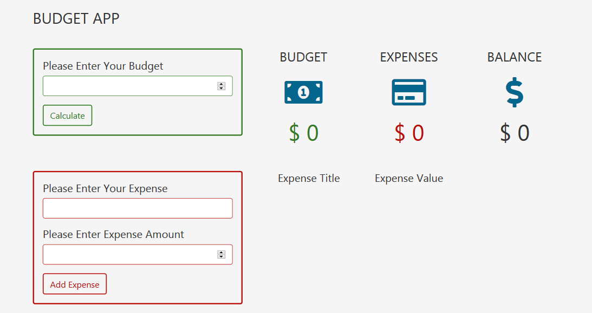

# BUDGET-APP

## Table of contents

- [General info](#general-info)
- [Technologies](#technologies)
- [Setup](#setup)
- [Screen Capture of Project](#screen-capture-of-project)
- [Project Status](#project-status)
- [Contact](#contact)

## General info

This project is a study case for this video tutorial https://www.youtube.com/watch?v=m_HJ3juuFvo for `john-smilga`. for freecodecamp.org .

The achievements of the project are;
Get more wrapped up concepts about classes in JS and how to use `this` Keyword
how to parse through DOM and use the data-id property in DOM .
Here is a demo for the final project [here](https://rashaali84.github.io/budget-app/)

## Technologies

Project is created with:

- JScript
- HTML5 /CSS3

## Setup

Clone this repository and start using it with your editor.

## Screen Capture of Project

## Project Status

Project is finished .

## Contact

Here is a link for my repository [my repository](https://rashaali84.github.io/)
